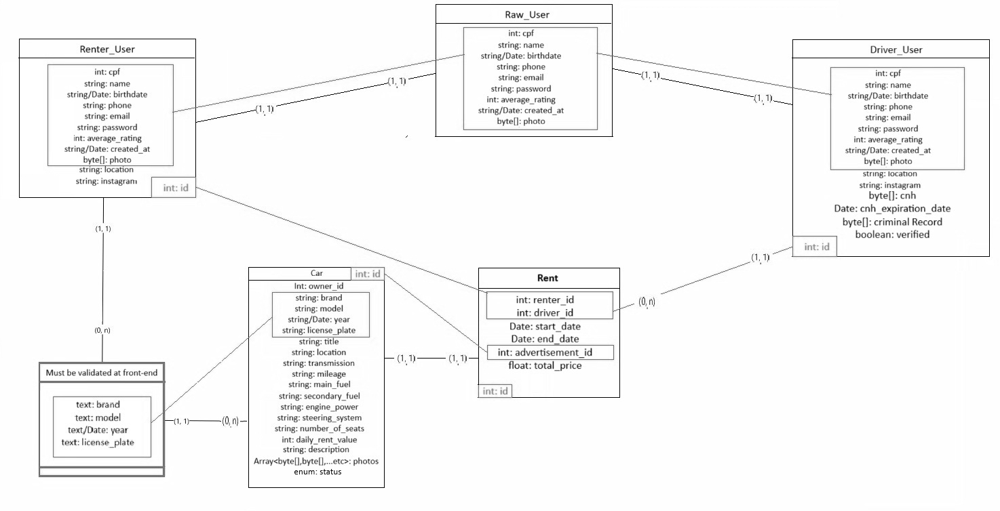

# README - Back-End

## Requerimentos para execução da parte de Back-End do projeto:
JDK(Java Development Kit 17), para este projeto foi utilizado a distribuição Amazon Corretto cujo link de download se encontra logo abaixo:

Download: https://docs.aws.amazon.com/corretto/latest/corretto-17-ug/downloads-list.html

  
Docker, para este projeto foi utilizado o Docker para criação do banco de dados MySQL, sendo necessária a sua instalação para que a aplicação funcione corretamente.

OBS: Para configuração do banco as instruções podem ser encontradas no arquivo "MaisPraTi2024-Squad07-Back-End\Alucar\src\main\java\com\maisprati\codifica\alucar\Docker\Alucar_Production\README"

Download: https://www.docker.com/
  
## Iniciando o projeto para teste:
Execute o arquivo compilado .JAR (É esperado que o banco de dados Docker/MySQL esteja ativo nesse momento): 

Path: " ..\MaisPraTi2024-Squad07-Back-End\Alucar\target\Alucar-0.0.1-SNAPSHOT.jar "

## Lógica das entidades envolvidas:

## Documentação da API
https://documenter.getpostman.com/view/37433733/2sAYk7S479
/
